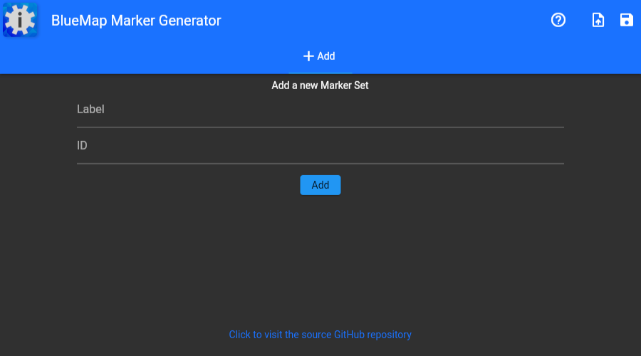
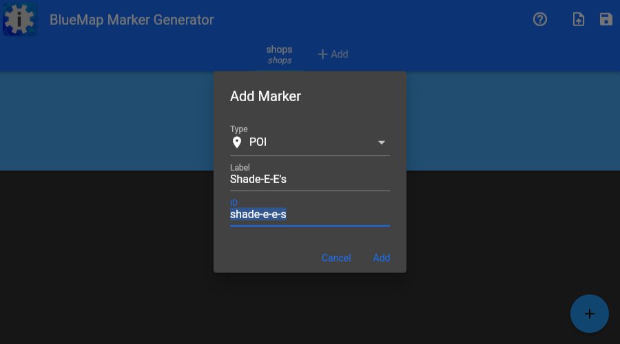
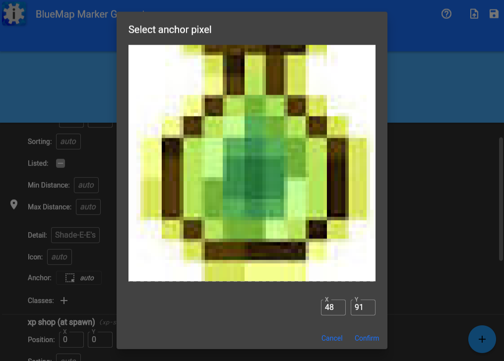
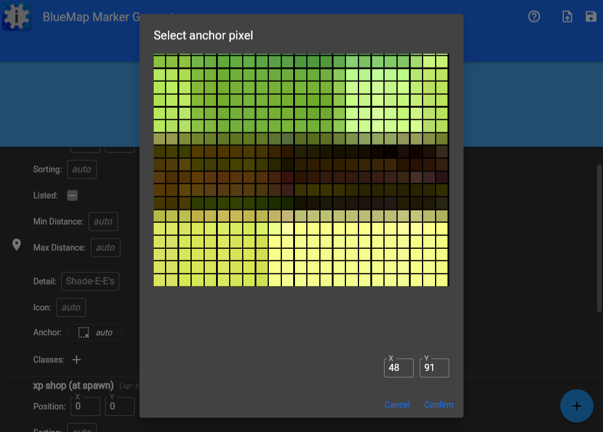
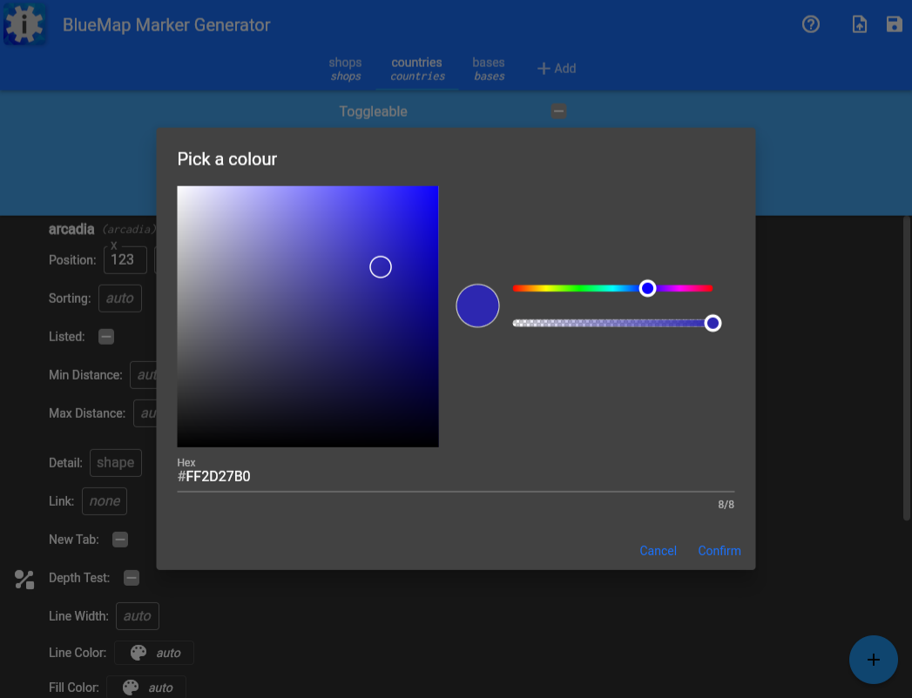
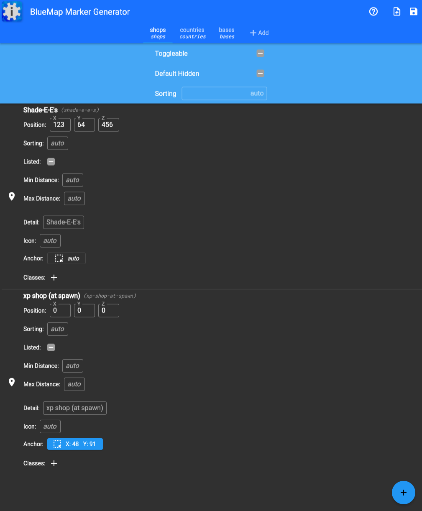
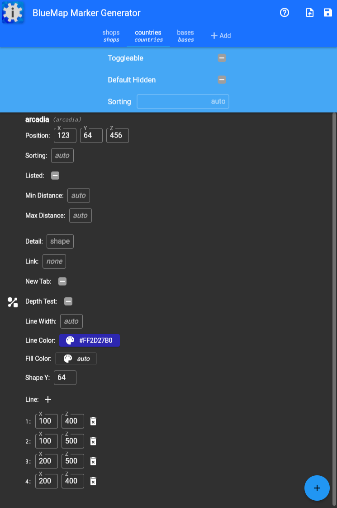

# BlueMap Marker Generator
A webapp that helps generate BlueMap markers

## Running locally
0. Make sure you have set up a proper Flutter development environment for the Web target. [docs.flutter.dev/get-started](https://docs.flutter.dev/get-started)
1. Clone the project and cd into it.
2. Run `flutter pub get` to download all the dependencies.
3. Run `flutter run` to run the project. You may need to then type a number to select your browser.

## Screenshots

